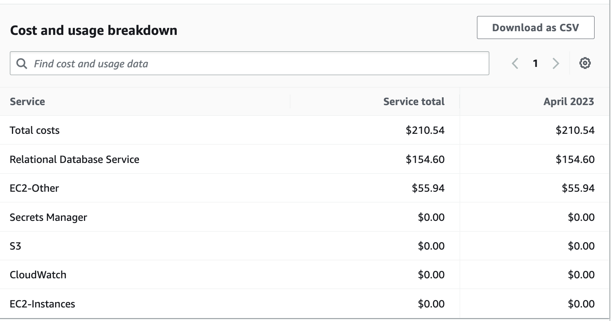

# OpenEMR on AWS Fargate

# Disclaimers

### Third Party Packages
This package depends on and may incorporate or retrieve a number of third-party
software packages (such as open source packages) at install-time or build-time
or run-time ("External Dependencies"). The External Dependencies are subject to
license terms that you must accept in order to use this package. If you do not
accept all of the applicable license terms, you should not use this package. We
recommend that you consult your company’s open source approval policy before
proceeding.

Provided below is a list of External Dependencies and the applicable license
identification as indicated by the documentation associated with the External
Dependencies as of Amazon's most recent review.

THIS INFORMATION IS PROVIDED FOR CONVENIENCE ONLY. AMAZON DOES NOT PROMISE THAT
THE LIST OR THE APPLICABLE TERMS AND CONDITIONS ARE COMPLETE, ACCURATE, OR
UP-TO-DATE, AND AMAZON WILL HAVE NO LIABILITY FOR ANY INACCURACIES. YOU SHOULD
CONSULT THE DOWNLOAD SITES FOR THE EXTERNAL DEPENDENCIES FOR THE MOST COMPLETE
AND UP-TO-DATE LICENSING INFORMATION.

YOUR USE OF THE EXTERNAL DEPENDENCIES IS AT YOUR SOLE RISK. IN NO EVENT WILL
AMAZON BE LIABLE FOR ANY DAMAGES, INCLUDING WITHOUT LIMITATION ANY DIRECT,
INDIRECT, CONSEQUENTIAL, SPECIAL, INCIDENTAL, OR PUNITIVE DAMAGES (INCLUDING
FOR ANY LOSS OF GOODWILL, BUSINESS INTERRUPTION, LOST PROFITS OR DATA, OR
COMPUTER FAILURE OR MALFUNCTION) ARISING FROM OR RELATING TO THE EXTERNAL
DEPENDENCIES, HOWEVER CAUSED AND REGARDLESS OF THE THEORY OF LIABILITY, EVEN
IF AMAZON HAS BEEN ADVISED OF THE POSSIBILITY OF SUCH DAMAGES. THESE LIMITATIONS
AND DISCLAIMERS APPLY EXCEPT TO THE EXTENT PROHIBITED BY APPLICABLE LAW.

 * openemr (Repository: https://github.com/openemr/openemr // License: https://github.com/openemr/openemr/blob/master/LICENSE) - GPL-3.0

### General

AWS does not represent or warrant that this AWS Content is production ready.  You are responsible for making your own independent assessment of the information, guidance, code and other AWS Content provided by AWS, which may include you performing your own independent testing, securing, and optimizing. You should take independent measures to ensure that you comply with your own specific quality control practices and standards, and to ensure that you comply with the local rules, laws, regulations, licenses and terms that apply to you and your content.  If you are in a regulated industry, you should take extra care to ensure that your use of this AWS Content, in combination with your own content, complies with applicable regulations (for example, the Health Insurance Portability and Accountability Act of 1996).   AWS does not make any representations, warranties or guarantees that this AWS Content will result in a particular outcome or result. 

# Instructions

### 1. Installing dependencies

This project is set up like a standard Python project.  The initialization
process also creates a virtualenv within this project, stored under the `.venv`
directory.  To create the virtualenv it assumes that there is a `python3`
(or `python` for Windows) executable in your path with access to the `venv`
package. If for any reason the automatic creation of the virtualenv fails,
you can create the virtualenv manually.

To manually create a virtualenv on MacOS and Linux:

```
$ python3 -m venv .venv
```

After the init process completes and the virtualenv is created, you can use the following
step to activate your virtualenv.

```
$ source .venv/bin/activate
```

If you are a Windows platform, you would activate the virtualenv like this:

```
% .venv\Scripts\activate.bat
```

Once the virtualenv is activated, you can install the required dependencies.

```
$ pip install -r requirements.txt
```

At this point you can now synthesize the CloudFormation template for this code.

```
$ cdk synth
```

You can also deploy using CDK as well.

```
$ cdk deploy
```

To add additional dependencies, for example other CDK libraries, just add
them to your `setup.py` file and rerun the `pip install -r requirements.txt`
command.

### 2. IP Range Access

By default, if you run `cdk deploy`, the security group that is assigned to the load balancer won't be open to the public internet. This is for security purposes. Instead we need to allowlist an IP range using the cdk.json file. As an example:

```
"security_group_ip_range": null
```

could be set to

```
"security_group_ip_range": "31.89.197.141/32",
```

Which will give access to only `31.89.197.141`.

### 3. Accessing OpenEMR

After we run `cdk deploy`, we will receive a url in the terminal. Going to that URL on our browser will take us to the OpenEMR authentication page.


Username is `admin` and password can be retrieved from [AWS Secrets Manager](https://aws.amazon.com/secrets-manager/). Navigate to the AWS console and go the Secrets Manager service. You will see a secret there which has a name that starts with `Password...`.


After entering username and password we should be able to get access to the OpenEMR UI.


# Architecture and Cost

This solution uses a variety of AWS services including [Amazon ECS](https://aws.amazon.com/ecs/), [AWS Fargate](https://aws.amazon.com/fargate/), [AWS WAF](https://aws.amazon.com/waf/), [Amazon CloudWatch](https://aws.amazon.com/cloudwatch/). For a full list you can review the cdk stack. Architecture diagram below shows how this solution comes together.


Even though it will depend on a lot of factors such as traffic and storage, this solution costs around ~220$ per month based on our experiments. Majority of the costs will be incurred by Fargate and RDS. Feel free to change the RDS database to a smaller instance to reduce the cost even more.




# Regarding Security

### Using cdk_nag

We instrumented this project with [cdk_nag](https://github.com/cdklabs/cdk-nag). In your app.py file we placed 2 commented out cdk_nag checks.

```python
from cdk_nag import AwsSolutionsChecks, HIPAASecurityChecks

app = cdk.App()
cdk.Aspects.of(app).add(AwsSolutionsChecks(verbose=True))
cdk.Aspects.of(app).add(HIPAASecurityChecks(verbose=True))
```

If you'd like you can enable the cdk_nag checks and fix any issues found therein. While this may assist with complying with certain aspects of HIPAA we make no claims that this alone will result in compliance with HIPAA. Please see the general disclaimer at the top of this README for more information. 

### Container Vulnerabilities

We recommend periodically scanning the container image used in this project. There are multiple ways to achieve that goal. 2 of them are:

1. Upload the container image to ECR and enable scanning
2. You can use [trivy](https://github.com/aquasecurity/trivy)

## Useful commands

 * `cdk ls`          list all stacks in the app
 * `cdk synth`       emits the synthesized CloudFormation template
 * `cdk deploy`      deploy this stack to your default AWS account/region
 * `cdk diff`        compare deployed stack with current state
 * `cdk docs`        open CDK documentation

